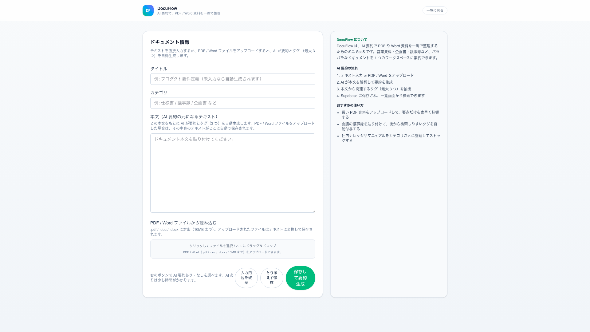
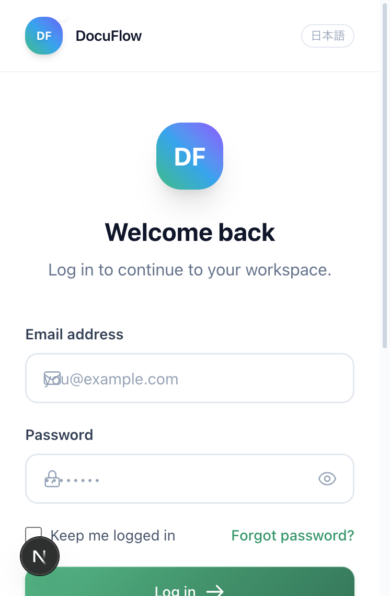
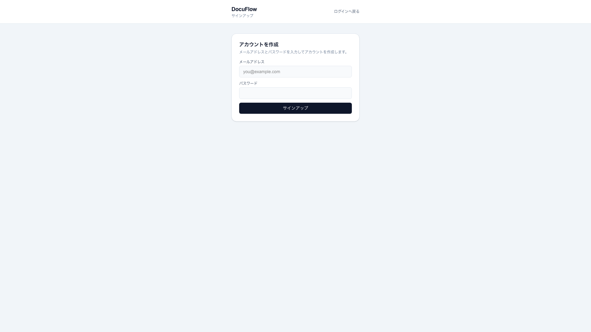
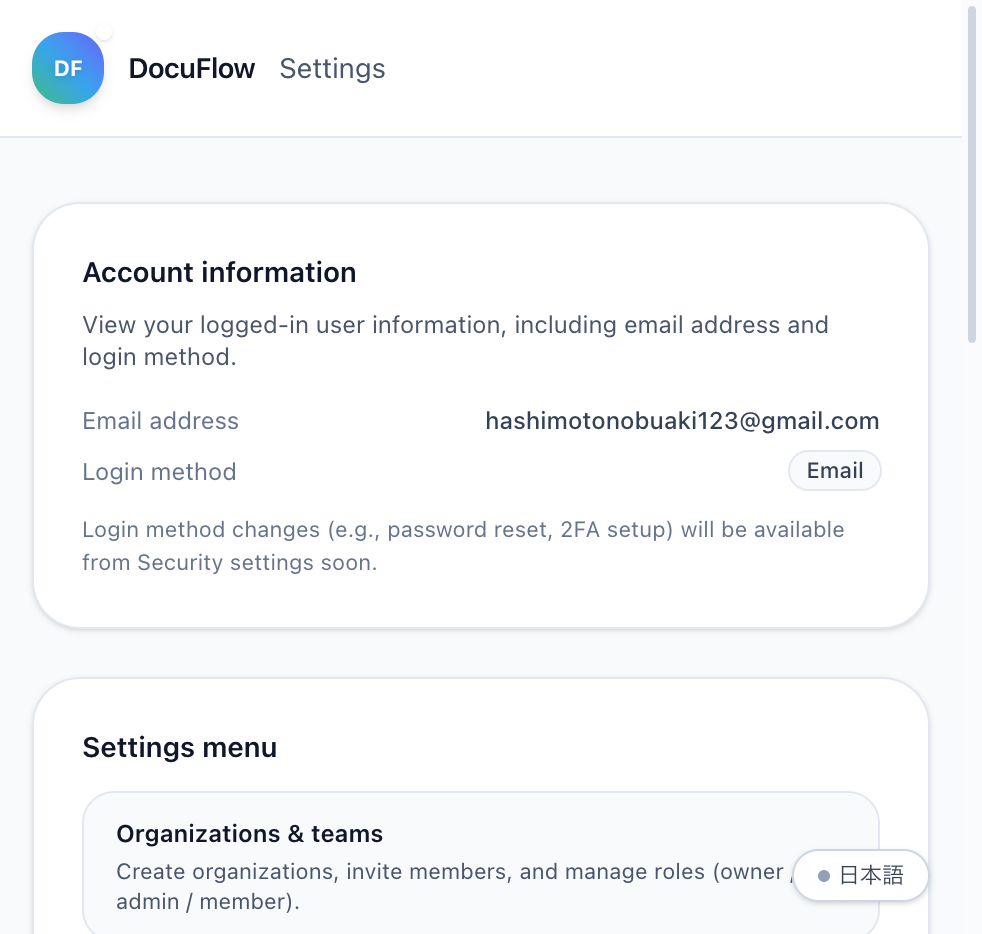

<div align="center">

<br />

# 📄 DocuFlow

### AI-Powered Document Workspace

**PDF・Word を一瞬で要約。スマートなドキュメント管理を。**

<br />

[](https://github.com/hashimotonobuaki123-cmyk/docuflow/actions)
[](https://codecov.io/gh/hashimotonobuaki123-cmyk/docuflow)
[](LICENSE)
[](https://www.typescriptlang.org/)
[](https://nextjs.org/)
[](https://react.dev/)

<br />

<a href="https://docuflow-azure.vercel.app" target="_blank">
  
</a>

<br />
<br />

[**📖 Docs**](docs/) &nbsp;&nbsp;·&nbsp;&nbsp; [**🐛 Bug Report**](https://github.com/hashimotonobuaki123-cmyk/docuflow/issues) &nbsp;&nbsp;·&nbsp;&nbsp; [**✨ Feature Request**](https://github.com/hashimotonobuaki123-cmyk/docuflow/issues)

<br />

---

### 🌍 English Summary

> **DocuFlow** is an AI-powered document workspace that transforms how teams organize knowledge.  
> Drop a PDF or Word file, and AI instantly generates summaries, tags, and searchable content.  
> Built with Next.js 16, Supabase, and OpenAI — designed for modern, async-first teams.

---

<br />


<br />
<br />

</div>

<br />

## 💡 About

**DocuFlow** は、AI を活用した次世代のドキュメント管理プラットフォームです。

会議メモ、仕様書、企画書などのドキュメントをドラッグ＆ドロップするだけで、AI が自動的に内容を分析し、**要約**・**タグ付け**・**タイトル生成**を実行。煩雑なドキュメント整理を劇的に効率化します。

<br />

<div align="center">

| 🎯 課題 | ✨ DocuFlow の解決策 |
|:---:|:---:|
| ドキュメントが増えると探せない | AI が自動でタグ付け & 全文検索 |
| 要約を書くのが面倒 | GPT-4 が 3〜5 行で自動要約 |
| PDF・Word の中身が検索できない | テキスト抽出して検索可能に |
| 共有が手間 | ワンクリックで共有リンク発行 |

</div>

<br />

## 🎮 Try the Demo

<div align="center">

**👉 [https://docuflow-azure.vercel.app](https://docuflow-azure.vercel.app)**

</div>

デモ環境には **15件以上のサンプルドキュメント** （仕様書・議事録・企画書・レポート・マニュアル）が登録されています。以下の流れで、DocuFlow の AI 機能をぜひ体験してください！

### 📋 おすすめの試し方

| Step | やること | 見どころ |
|:----:|:---------|:---------|
| 1️⃣ | `/auth/login` でログイン | モダンな認証UI、パスワード強度チェック |
| 2️⃣ | `/app` ダッシュボードを確認 | ドキュメント数・最近のアクティビティ・AI類似検索結果 |
| 3️⃣ | 検索バーに **「認証」** と入力 | API設計仕様書・オンボーディングマニュアルなどがヒット |
| 4️⃣ | 検索バーに **「売上」** と入力 | 月次レポート・キャンペーン企画書がヒット |
| 5️⃣ | ドキュメントをクリックして詳細表示 | AI要約・自動タグ・バージョン履歴 |
| 6️⃣ | 「共有リンク発行」ボタンを押す | ワンクリックで公開リンク生成 |

### 🔍 AI ベクトル検索のデモ

登録されているドキュメント例と、検索キーワードの対応：

```
「認証」「セキュリティ」 → API設計仕様書、オンボーディングマニュアル
「売上」「マーケティング」 → 月次売上レポート、キャンペーン企画書
「設計」「データベース」   → DB設計書、システムリプレイス提案書
「会議」「進捗」          → 週次定例MTG議事録、キックオフ議事録
```

> 💡 **Tip**: キーワードだけでなく、「ユーザー登録の流れを知りたい」のような **自然言語の質問** でも検索できます！

<br />

## ✨ Features

<table>
<tr>
<td width="33%" valign="top">

### 🤖 AI Auto-Summary

GPT-4.1-mini による高精度な自動要約。日本語に最適化されたプロンプトで、文書の要点を 3〜5 行に凝縮。

</td>
<td width="33%" valign="top">

### 🏷️ Smart Tagging

文書内容を解析し、最適なタグを最大 3 つ自動生成。後から探しやすいドキュメント管理を実現。

</td>
<td width="33%" valign="top">

### 📄 File Support

PDF・Word ファイルをドラッグ＆ドロップ。`pdf-parse` / `mammoth` でテキスト抽出し、即座に AI 処理。

</td>
</tr>
<tr>
<td width="33%" valign="top">

### 🔍 Full-Text Search

タイトル・要約・本文・タグを横断検索。カテゴリフィルタ、お気に入り、ピン留めで素早くアクセス。

</td>
<td width="33%" valign="top">

### 🔗 One-Click Share

共有リンクをワンクリックで発行。認証不要で閲覧可能な公開ビュー。いつでも停止可能。

</td>
<td width="33%" valign="top">

### 📝 Version History

編集履歴を自動保存。過去バージョンをいつでも確認でき、変更の追跡が容易に。

</td>
</tr>
<tr>
<td width="33%" valign="top">

### ⌨️ Command Palette

`⌘K` で開くコマンドパレット。Notion/Linear風のモダンなナビゲーションを実現。

</td>
<td width="33%" valign="top">

### 🌙 Dark Mode

ライト / ダーク / システム設定の 3 モード対応。目に優しいテーマ切り替え。

</td>
<td width="33%" valign="top">

### 🔔 Toast Notifications

操作結果をリアルタイム通知。成功・エラー・警告を美しいトーストで表示。

</td>
</tr>
</table>

<br />

<div align="center">

### ⌨️ Keyboard Shortcuts

| Shortcut | Action |
|:--------:|:-------|
| `⌘K` | コマンドパレットを開く |
| `?` | ショートカットヘルプを表示 |
| `G` `D` | ダッシュボードへ移動 |
| `G` `N` | 新規作成ページへ移動 |
| `/` | 検索にフォーカス |

</div>

<br />

## 🛠️ Tech Stack

<div align="center">

### Frontend

[](https://nextjs.org/)
[](https://react.dev/)
[](https://www.typescriptlang.org/)
[](https://tailwindcss.com/)

### Backend & Infrastructure

[](https://supabase.com/)
[](https://www.postgresql.org/)
[](https://openai.com/)
[](https://vercel.com/)

### Testing & Quality

[](https://vitest.dev/)
[](https://playwright.dev/)
[](https://eslint.org/)
[](https://prettier.io/)

</div>

<br />

## 📸 Screenshots

<div align="center">

### 🏠 メイン画面

<table>
<tr>
<td align="center" width="50%">

**Dashboard**
<br />
ドキュメント一覧・検索・フィルタリング


</td>
<td align="center" width="50%">

**New Document**
<br />
AI要約付き新規作成・ファイルアップロード



</td>
</tr>
</table>

### 📄 ドキュメント管理

<table>
<tr>
<td align="center" width="50%">

**Document Detail**
<br />
詳細表示・AI要約・タグ・バージョン履歴


</td>
<td align="center" width="50%">

**Share View**
<br />
認証不要の公開共有ページ


</td>
</tr>
</table>

### 🔐 認証 & 設定

<table>
<tr>
<td align="center" width="33%">

**Login**
<br />
メール認証



</td>
<td align="center" width="33%">

**Signup**
<br />
新規アカウント作成



</td>
<td align="center" width="33%">

**Settings**
<br />
ユーザー設定



</td>
</tr>
</table>

</div>

<br />

## 🚀 Getting Started

### Prerequisites

```
Node.js >= 22.x
npm >= 10.x
Supabase Account
OpenAI API Key
```

### Installation

```bash
# Clone the repository
git clone https://github.com/tanasho/dooai.git
cd dooai

# Install dependencies
npm install

# Set up environment variables
cp .env.example .env.local
# Edit .env.local with your credentials

# Start development server
npm run dev
```

### Environment Variables

```env
# Supabase
NEXT_PUBLIC_SUPABASE_URL=https://your-project.supabase.co
NEXT_PUBLIC_SUPABASE_ANON_KEY=your-anon-key

# OpenAI
OPENAI_API_KEY=your-openai-api-key

# Optional: Account deletion
SUPABASE_SERVICE_ROLE_KEY=your-service-role-key
```

<br />

## 📁 Project Structure

```
dooai/
├── 📂 app/                     # Next.js App Router
│   ├── 📂 app/                # Dashboard & workspace
│   ├── 📂 auth/               # Authentication pages
│   │   ├── login/
│   │   ├── signup/
│   │   ├── forgot/
│   │   └── reset/
│   ├── 📂 documents/          # Document CRUD
│   ├── 📂 new/                # Create new document
│   └── 📂 share/              # Public share view
│
├── 📂 components/             # Reusable UI components
├── 📂 lib/                    # Core utilities
│   ├── ai.ts                 # OpenAI integration
│   ├── filterDocuments.ts    # Search & filter logic
│   └── supabase*.ts          # Database clients
│
├── 📂 tests/                  # Test suites
├── 📂 docs/                   # Documentation
└── 📂 types/                  # TypeScript definitions
```

<br />

## 🏗️ Architecture

```
┌──────────────────────────────────────────────────────────────────────┐
│                              Client                                   │
│  ┌────────────┐  ┌────────────┐  ┌────────────┐  ┌────────────┐     │
│  │   /app     │  │   /new     │  │ /documents │  │   /share   │     │
│  │ Dashboard  │  │  Upload    │  │   Detail   │  │   Public   │     │
│  └─────┬──────┘  └─────┬──────┘  └─────┬──────┘  └─────┬──────┘     │
└────────┼───────────────┼───────────────┼───────────────┼─────────────┘
         │               │               │               │
         └───────────────┴───────┬───────┴───────────────┘
                                 │
                                 ▼
┌──────────────────────────────────────────────────────────────────────┐
│                       Next.js 16 App Router                          │
│  ┌─────────────────────────────────────────────────────────────┐    │
│  │                    Server Components                         │    │
│  │  • Data fetching with Supabase                              │    │
│  │  • AI processing with OpenAI                                │    │
│  │  • File parsing (PDF/Word)                                  │    │
│  └─────────────────────────────────────────────────────────────┘    │
│  ┌─────────────────────────────────────────────────────────────┐    │
│  │                       Middleware                             │    │
│  │  • Authentication guard                                      │    │
│  │  • Route protection                                         │    │
│  └─────────────────────────────────────────────────────────────┘    │
└──────────────────────────────────┬───────────────────────────────────┘
                                   │
                   ┌───────────────┴───────────────┐
                   │                               │
                   ▼                               ▼
┌──────────────────────────────┐   ┌──────────────────────────────┐
│          Supabase            │   │           OpenAI             │
│  ┌────────────────────────┐  │   │  ┌────────────────────────┐  │
│  │    Authentication      │  │   │  │     GPT-4.1-mini       │  │
│  │    • Email/Password    │  │   │  │  • Summary generation  │  │
│  │    • Session mgmt      │  │   │  │  • Tag extraction      │  │
│  └────────────────────────┘  │   │  │  • Title generation    │  │
│  ┌────────────────────────┐  │   │  └────────────────────────┘  │
│  │      PostgreSQL        │  │   └──────────────────────────────┘
│  │  • documents           │  │
│  │  • document_versions   │  │
│  │  • activity_logs       │  │
│  │  • RLS policies        │  │
│  └────────────────────────┘  │
└──────────────────────────────┘
```

<br />

## 💻 Development

```bash
# Run development server
npm run dev

# Run tests
npm test

# Run tests with coverage
npm run test:coverage

# Lint code
npm run lint

# Format code
npm run format

# Type check
npm run type-check

# Run all validations
npm run validate

# Build for production
npm run build
```

<br />

## 📖 Documentation

| Document | Description |
|:---------|:------------|
| [📋 Specification](docs/spec-docuflow.md) | 機能仕様の詳細 |
| [🎨 UI Flow](docs/ui-flow.md) | 画面遷移とユーザーフロー |
| [🗄️ Database Schema](docs/db-schema.md) | テーブル定義と RLS |
| [🏗️ Architecture](docs/architecture.md) | システム設計 |
| [🚀 Operations Guide](docs/operations.md) | 運用ガイド・デプロイ手順 |
| [⚠️ Error Handling](docs/error-handling.md) | エラーハンドリング方針 |
| [📊 Monitoring](docs/monitoring.md) | 監視・ログ設計 |

<br />

## 🗺️ Roadmap

### ✅ Completed

- [x] 基本的な CRUD 機能
- [x] AI 要約・タグ生成
- [x] PDF / Word 対応
- [x] 共有リンク機能
- [x] バージョン履歴
- [x] ⌨️ コマンドパレット (`⌘K`)
- [x] 🌙 ダークモード対応
- [x] 🔔 トースト通知
- [x] ⌨️ キーボードショートカット
- [x] 📱 レスポンシブデザイン
- [x] 🔍 AI ベクトル検索 (pgvector + OpenAI Embeddings)
- [x] 🔒 Row Level Security (RLS) 完全実装
- [x] 📊 Sentry によるエラー監視
- [x] 📱 PWA 対応 (オフライン＆インストール可能)

### 🚧 In Progress

- [ ] 🏢 チーム / 組織対応
- [ ] 📊 バージョン差分表示
- [ ] 🌐 多言語対応 (i18n)
- [ ] 💬 AI チャットボット連携

<br />

## 📝 Product Story

### Why I Built DocuFlow

現場のエンジニアとして、何度も同じ課題にぶつかりました。

> *「あの仕様書、どこにあったっけ？」*  
> *「会議の決定事項、誰がまとめてくれたんだっけ？」*  
> *「新人に引き継ぐドキュメント、探すだけで1時間かかった…」*

Notion、Confluence、Google Drive… ツールは増えても、**情報が見つからない問題は解決しませんでした**。

DocuFlow は、この「ドキュメント迷子問題」を AI の力で解決するために作りました。

### Who Will Use This?

DocuFlow は、以下のようなチーム・シーンを想定しています：

| 🎯 ターゲット | 📋 ユースケース |
|:------------|:---------------|
| **スタートアップ (5〜30人)** | 仕様書・議事録・企画書を一元管理。検索で「あの話どこだっけ」をゼロに |
| **リモートワークチーム** | 非同期コミュニケーションの情報ハブとして。要約で長文も一瞬で把握 |
| **エンジニアチーム** | 技術ドキュメント、設計書、ポストモーテムを AI タグ付けで自動整理 |
| **フリーランス / 個人** | クライアントとの議事録や提案書を共有リンクで安全に送信 |

### Roadmap Vision

DocuFlow は「**AI が情報整理を肩代わりする世界**」を目指しています。

1. **Phase 1 (Current)**: AI 要約・タグ・ベクトル検索で「探す」を革新 ✅
2. **Phase 2**: チーム機能・権限管理で「共有する」を強化 🚧
3. **Phase 3**: AI チャットボットで「聞く」だけで情報にアクセス 🔮

<br />

---

<br />

## 🤝 Contributing

コントリビューションは大歓迎です！

<a href="https://github.com/tanasho/dooai/graphs/contributors">
  
</a>

1. Fork the Project
2. Create your Feature Branch (`git checkout -b feature/AmazingFeature`)
3. Commit your Changes (`git commit -m 'feat: Add AmazingFeature'`)
4. Push to the Branch (`git push origin feature/AmazingFeature`)
5. Open a Pull Request

詳細は [CONTRIBUTING.md](CONTRIBUTING.md) をご覧ください。

<br />

## 📄 License

Distributed under the MIT License. See [LICENSE](LICENSE) for more information.

<br />

---

<div align="center">

### ⭐ Star this repo if you find it useful!

<br />

**Built with passion using**

[](https://nextjs.org/)
[](https://supabase.com/)
[](https://openai.com/)

<br />

[Back to Top ↑](#docuflow)

</div>
