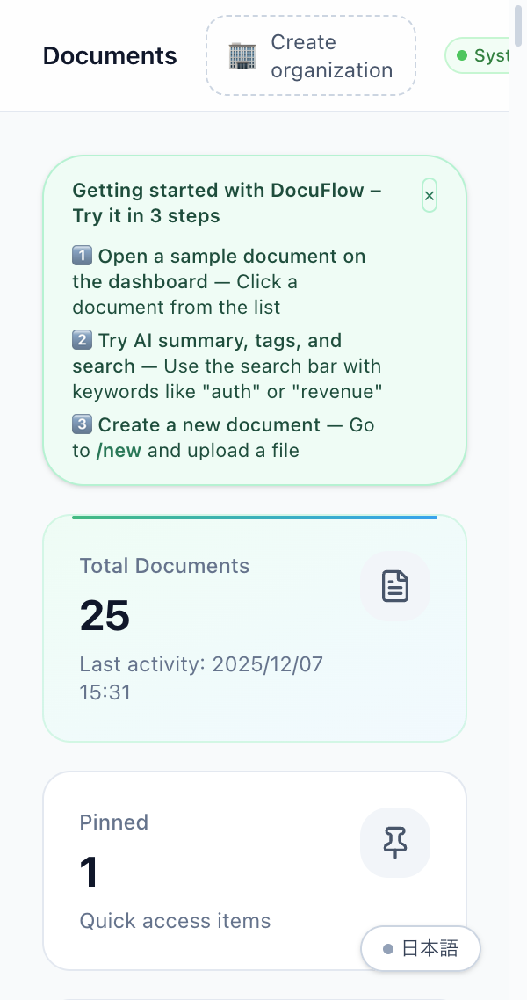
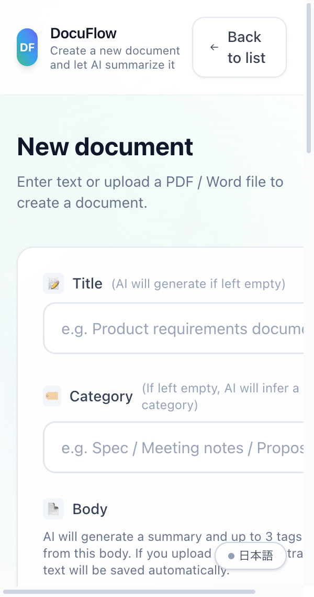
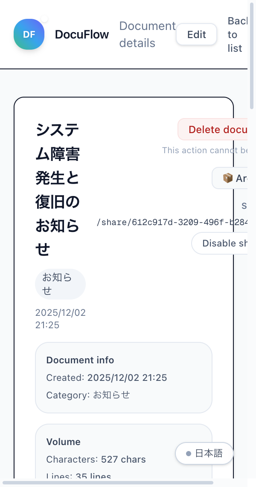
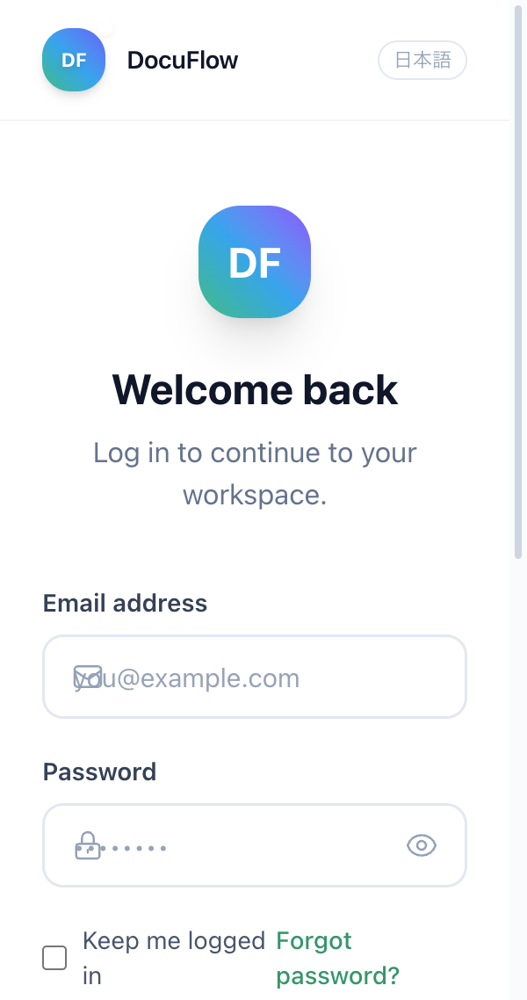
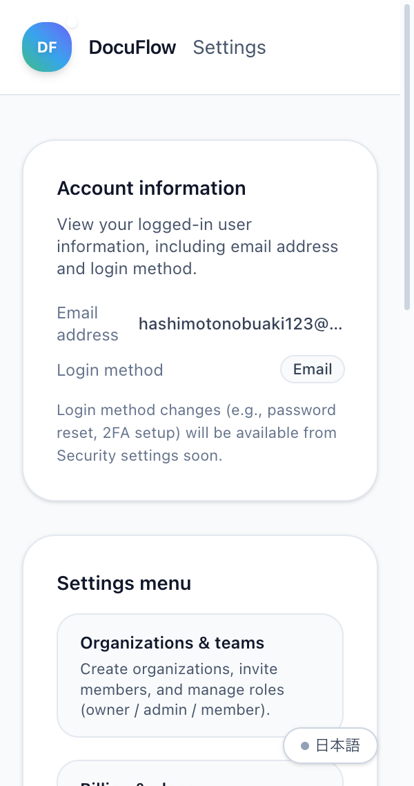
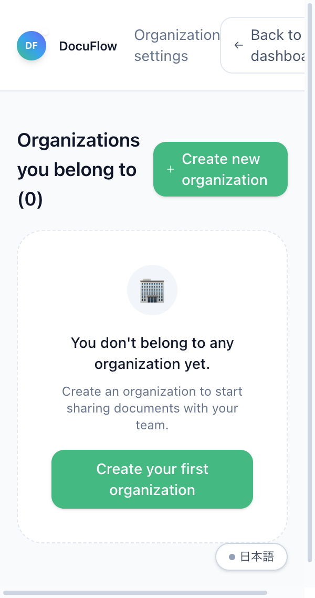
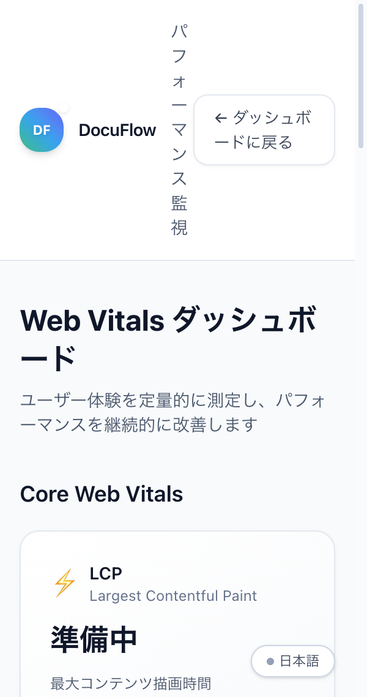

<div align="center">

<br />

# 📄 DocuFlow

### AI-Powered Document Workspace for Modern Teams

**Transform PDFs & Word files into searchable, summarized knowledge in seconds.**

<br />

- 🇯🇵 **Japanese README**: [`README.md`](README.md)

[//]: # (README_en.md is the EN version. README.md is the JA default.)

[](https://github.com/AyumuKobayashiproducts/docuflow/actions)
[](https://github.com/AyumuKobayashiproducts/docuflow/actions/workflows/lighthouse.yml)
[](https://codecov.io/gh/AyumuKobayashiproducts/docuflow)
[](https://www.typescriptlang.org/)
[](tests/)

<br />

<a href="https://docuflow-azure.vercel.app/app?lang=en" target="_blank">
  
</a>
&nbsp;&nbsp;
<a href="docs/architecture.md">
  
</a>

<br />
<br />

```
┌─────────────────────────────────────────────────────────────────┐
│  📊 Key Metrics (Production)                                    │
├─────────────────────────────────────────────────────────────────┤
│  ⚡ Lighthouse Performance: 92+    │  🧪 Test Coverage: 85%+   │
│  🔒 Security Audit: 0 Critical     │  📦 Bundle Size: <200KB   │
│  ⏱️ Build Time: ~45s               │  🌐 i18n: EN/JA Complete  │
└─────────────────────────────────────────────────────────────────┘
```

</div>

<br />

---

## 🎯 Executive Summary

> **DocuFlow is a production-grade B2B SaaS** that demonstrates end-to-end engineering excellence—from database schema design to CI/CD pipelines—built entirely by a single engineer.

### What This Repository Proves

| Dimension | Evidence |
|:----------|:---------|
| **Full-Stack Ownership** | Auth → RBAC → Billing → Analytics → Observability → i18n |
| **Architecture Design** | Multi-tenant RLS, vector search, event-driven activity logs |
| **Quality Engineering** | 130+ tests, E2E coverage, Lighthouse CI, strict TypeScript |
| **Production Readiness** | Sentry monitoring, Web Vitals dashboard, PWA support |
| **Developer Experience** | API docs, SDK patterns, comprehensive documentation |

<br />

### 🔗 Quick Navigation for Reviewers

| If you want to see... | Go to |
|:----------------------|:------|
| The product in action (EN) | [**Live App Demo**](https://docuflow-azure.vercel.app/app?lang=en) |
| Landing page (EN) | [**/en**](https://docuflow-azure.vercel.app/en) |
| Demo page (EN, no login) | [**/demo/en**](https://docuflow-azure.vercel.app/demo/en) |
| System architecture | [`docs/architecture.md`](docs/architecture.md) |
| Database design & RLS | [`docs/db-schema.md`](docs/db-schema.md) |
| Test strategy | [`tests/`](tests/) · [`e2e/`](e2e/) |
| CI/CD pipelines | [`.github/workflows/`](.github/workflows) |
| Security design | [`docs/security.md`](docs/security.md) |

<br />

### 🌍 Language / Locale Behavior (EN-first for international reviewers)

- **Bilingual**: EN / JA
- **Default**:
  - Cookie (`docuflow_lang`) wins
  - Otherwise `Accept-Language`: `ja` → Japanese, everything else → English
- **Direct links**:
  - App (EN): `https://docuflow-azure.vercel.app/app?lang=en`
  - Landing (EN): `https://docuflow-azure.vercel.app/en`

<br />

---

## 🇯🇵 Japanese Overview

Japanese details live in **`README.md`** (screenshots, quick paths, setup, operations).

- 🇯🇵 **Japanese README**: [`README.md`](README.md)

<br />

---

## 🖼️ Product Screenshots

<div align="center">

### 📊 Dashboard — Document Workspace


<table>
<tr>
<td width="50%" align="center">

### 📝 New Document — AI Processing


</td>
<td width="50%" align="center">

### 📄 Document Detail — Summary & Tags


</td>
</tr>
<tr>
<td width="50%" align="center">

### 🔐 Login — Modern Auth UI


</td>
<td width="50%" align="center">

### ⚙️ Settings — Account & Preferences


</td>
</tr>
<tr>
<td width="50%" align="center">

### 🏢 Organizations — Team Management


</td>
<td width="50%" align="center">

### 📈 Web Vitals — Performance Dashboard


</td>
</tr>
</table>

</div>

<br />

---

## 💡 Problem → Solution

<table>
<tr>
<th width="50%">🔴 Real Business Problem</th>
<th width="50%">🟢 DocuFlow's Solution</th>
</tr>
<tr>
<td>

**"Where's that spec doc?"**

Teams waste **15-30 min/day** searching for documents across Slack, Drive, Notion, and email.

</td>
<td>

**Vector Search + AI Tags**

Natural language queries find docs in **<3 seconds**. AI auto-tags every upload for instant discovery.

</td>
</tr>
<tr>
<td>

**"No one reads 50-page PDFs"**

Important decisions buried in long documents. New team members take weeks to onboard.

</td>
<td>

**GPT-4 Auto-Summary**

Every document gets a **3-5 line summary** in seconds. Onboarding time drops dramatically.

</td>
</tr>
<tr>
<td>

**"Can you send me a copy?"**

Sharing docs externally requires downloads, attachments, version confusion.

</td>
<td>

**One-Click Share Links**

Generate a public read-only link in one click. Revoke anytime. No account needed for viewers.

</td>
</tr>
<tr>
<td>

**"Who changed what?"**

No audit trail. Compliance risks. Finger-pointing when things go wrong.

</td>
<td>

**Version History + Activity Logs**

Every edit tracked. Compare any version. Full audit trail per organization.

</td>
</tr>
</table>

<br />

---

## 🏗️ Architecture Deep Dive

### System Overview

```
┌─────────────────────────────────────────────────────────────────────────────┐
│                                 CLIENT                                       │
│  ┌──────────┐  ┌──────────┐  ┌──────────┐  ┌──────────┐  ┌──────────┐      │
│  │Dashboard │  │ Upload   │  │ Document │  │ Settings │  │  Share   │      │
│  │  /app    │  │  /new    │  │  Detail  │  │  RBAC    │  │  Public  │      │
│  └────┬─────┘  └────┬─────┘  └────┬─────┘  └────┬─────┘  └────┬─────┘      │
└───────┼─────────────┼─────────────┼─────────────┼─────────────┼─────────────┘
        │             │             │             │             │
        └─────────────┴──────┬──────┴─────────────┴─────────────┘
                             │
                             ▼
┌─────────────────────────────────────────────────────────────────────────────┐
│                        NEXT.JS 16 APP ROUTER                                 │
│  ┌─────────────────────────────────────────────────────────────────────┐   │
│  │                      Server Components                               │   │
│  │  • ISR/SSG for static pages      • Streaming for large lists        │   │
│  │  • Server Actions for mutations  • Edge-ready middleware            │   │
│  └─────────────────────────────────────────────────────────────────────┘   │
│  ┌─────────────────────────────────────────────────────────────────────┐   │
│  │                         Middleware                                   │   │
│  │  • Auth guard (cookie-based)     • Rate limiting (in-memory)        │   │
│  │  • i18n locale detection         • Security headers                 │   │
│  └─────────────────────────────────────────────────────────────────────┘   │
└────────────────────────────────┬────────────────────────────────────────────┘
                                 │
                 ┌───────────────┴───────────────┐
                 │                               │
                 ▼                               ▼
┌────────────────────────────────┐ ┌────────────────────────────────┐
│           SUPABASE             │ │            OPENAI              │
│  ┌──────────────────────────┐  │ │  ┌──────────────────────────┐  │
│  │      PostgreSQL          │  │ │  │      GPT-4.1-mini        │  │
│  │  • 8 tables with RLS     │  │ │  │  • Summary generation    │  │
│  │  • pgvector for search   │  │ │  │  • Tag extraction        │  │
│  │  • Real-time subscriptions│  │ │  │  • Title generation     │  │
│  └──────────────────────────┘  │ │  └──────────────────────────┘  │
│  ┌──────────────────────────┐  │ │  ┌──────────────────────────┐  │
│  │         Auth             │  │ │  │   text-embedding-3-small │  │
│  │  • Email/Password        │  │ │  │  • 1536-dim vectors      │  │
│  │  • Google OAuth          │  │ │  │  • Cosine similarity     │  │
│  │  • Session management    │  │ │  └──────────────────────────┘  │
│  └──────────────────────────┘  │ └────────────────────────────────┘
└────────────────────────────────┘
```

### Key Architecture Decisions

| Decision | Why | Trade-off Accepted |
|:---------|:----|:-------------------|
| **Supabase over raw PostgreSQL** | Auth + RLS + Realtime out of the box. Faster to production. | Vendor lock-in, less control over DB tuning |
| **Server Components by default** | Reduced client JS, better SEO, simpler data fetching | Learning curve, some UI patterns harder |
| **pgvector over Pinecone** | Co-located with data, no extra service, lower latency | 100K+ vector scale would need dedicated solution |
| **Cookie-based auth over JWT** | Simpler middleware, no token refresh complexity | Requires `httpOnly` + `secure` flags |
| **Monorepo over microservices** | Single deploy, easier refactoring, lower ops burden | Scaling individual services harder |

<br />

---

## 🧪 Engineering Excellence

### Test Strategy (130+ Tests)

```
┌─────────────────────────────────────────────────────────────────┐
│                        TEST PYRAMID                              │
├─────────────────────────────────────────────────────────────────┤
│                                                                  │
│                          ▲ E2E (Playwright)                     │
│                         ╱ ╲   • Login flow                      │
│                        ╱   ╲  • Document CRUD                   │
│                       ╱     ╲ • Share link generation           │
│                      ─────────                                   │
│                     ╱         ╲                                  │
│                    ╱ Integration╲  • API routes                 │
│                   ╱   (Vitest)   ╲ • Supabase queries           │
│                  ─────────────────                               │
│                 ╱                 ╲                              │
│                ╱    Unit Tests    ╲  • Pure functions           │
│               ╱     (Vitest)       ╲ • i18n, filters, AI mocks  │
│              ───────────────────────                             │
│                                                                  │
│  Coverage: 85%+ │ 130 tests │ <2s total runtime                 │
└─────────────────────────────────────────────────────────────────┘
```

### Type Safety

```typescript
// Strict TypeScript configuration
{
  "compilerOptions": {
    "strict": true,
    "noUncheckedIndexedAccess": true,
    "exactOptionalPropertyTypes": true
  }
}

// Database types auto-generated from Supabase
type Document = Database['public']['Tables']['documents']['Row'];
type Organization = Database['public']['Tables']['organizations']['Row'];

// Discriminated unions for exhaustive checks
type ActivityAction =
  | 'create_document'
  | 'update_document'
  | 'delete_document'
  | 'archive_document';

function getActionLabel(action: ActivityAction): string {
  switch (action) {
    case 'create_document': return 'Created';
    case 'update_document': return 'Updated';
    case 'delete_document': return 'Deleted';
    case 'archive_document': return 'Archived';
    // TypeScript ensures all cases are handled
  }
}
```

### CI/CD Pipeline

```yaml
# .github/workflows/ci.yml
┌─────────────────────────────────────────────────────────────────┐
│                    CI Pipeline (Every Push)                      │
├─────────────────────────────────────────────────────────────────┤
│                                                                  │
│  ┌─────────┐   ┌─────────┐   ┌─────────┐   ┌─────────┐         │
│  │  Lint   │ → │  Type   │ → │  Test   │ → │  Build  │         │
│  │ ESLint  │   │  Check  │   │ Vitest  │   │  Next   │         │
│  └─────────┘   └─────────┘   └─────────┘   └─────────┘         │
│       │             │             │             │                │
│       ▼             ▼             ▼             ▼                │
│  ┌─────────┐   ┌─────────┐   ┌─────────┐   ┌─────────┐         │
│  │Security │   │Lighthouse│   │ E2E     │   │ Deploy  │         │
│  │ Audit   │   │   CI    │   │Playwright│   │ Vercel  │         │
│  └─────────┘   └─────────┘   └─────────┘   └─────────┘         │
│                                                                  │
│  Total: ~3 min │ Parallel jobs │ Fail-fast enabled              │
└─────────────────────────────────────────────────────────────────┘
```

### Performance Optimizations

| Optimization | Impact | Implementation |
|:-------------|:-------|:---------------|
| **Server Components** | -40% client JS | Default for all pages |
| **Image optimization** | -60% image size | Next.js Image with blur placeholder |
| **Route prefetching** | -200ms navigation | `<Link>` with viewport intersection |
| **Code splitting** | -30% initial bundle | Dynamic imports for modals/dialogs |
| **Streaming** | -50% TTFB for lists | `Suspense` boundaries |

<br />

---

## 🔐 Security Model

### Multi-Tenant Data Isolation

```sql
-- Row Level Security ensures data isolation
CREATE POLICY "Users can only see their org's documents"
ON documents FOR SELECT
USING (
  organization_id IN (
    SELECT organization_id 
    FROM organization_members 
    WHERE user_id = auth.uid()
  )
);

-- Public share is token-based via RPC (prevents anonymous enumeration)
-- NOTE: We do NOT allow anon SELECT on `documents` directly.
CREATE OR REPLACE FUNCTION get_shared_document(p_share_token TEXT)
RETURNS TABLE (id uuid, title text, raw_content text, created_at timestamptz)
LANGUAGE plpgsql SECURITY DEFINER AS $$
BEGIN
  RETURN QUERY
  SELECT d.id, d.title, d.raw_content, d.created_at
  FROM documents d
  WHERE d.share_token = p_share_token
    AND (d.share_expires_at IS NULL OR d.share_expires_at > NOW());
END; $$;
```

### RBAC Implementation

```
┌─────────────────────────────────────────────────────────────────┐
│                    ROLE HIERARCHY                                │
├─────────────────────────────────────────────────────────────────┤
│                                                                  │
│  OWNER ──────────────────────────────────────────────────────   │
│    │  • Delete organization                                     │
│    │  • Transfer ownership                                      │
│    │  • All admin permissions                                   │
│    ▼                                                            │
│  ADMIN ──────────────────────────────────────────────────────   │
│    │  • Invite/remove members                                   │
│    │  • Manage billing                                          │
│    │  • All member permissions                                  │
│    ▼                                                            │
│  MEMBER ─────────────────────────────────────────────────────   │
│       • Create/edit/delete own documents                        │
│       • View organization documents                             │
│       • Create share links                                      │
│                                                                  │
└─────────────────────────────────────────────────────────────────┘
```

### Security Checklist

- [x] **Authentication**: Supabase Auth with secure session cookies
- [x] **Authorization**: RLS policies on all tables
- [x] **Input Validation**: Zod schemas on API routes
- [x] **XSS Prevention**: React's built-in escaping + CSP headers
- [x] **CSRF Protection**: SameSite cookies + origin checks
- [x] **Rate Limiting**: In-memory rate limiter on sensitive routes
- [x] **Dependency Audit**: `npm audit` in CI, Dependabot enabled
- [x] **Secret Management**: Environment variables, never committed

<br />

---

## 📊 Observability

### Monitoring Stack

```
┌─────────────────────────────────────────────────────────────────┐
│                    OBSERVABILITY STACK                           │
├─────────────────────────────────────────────────────────────────┤
│                                                                  │
│  ┌─────────────┐  ┌─────────────┐  ┌─────────────┐              │
│  │   Sentry    │  │ Web Vitals  │  │  Vercel     │              │
│  │   Errors    │  │  Dashboard  │  │  Analytics  │              │
│  │ + Perf     │  │  /app/vitals │  │  Built-in   │              │
│  └──────┬──────┘  └──────┬──────┘  └──────┬──────┘              │
│         │                │                │                      │
│         └────────────────┼────────────────┘                      │
│                          │                                       │
│                          ▼                                       │
│              ┌───────────────────────┐                          │
│              │   Activity Logs       │                          │
│              │   (Supabase table)    │                          │
│              │   • User actions      │                          │
│              │   • Document events   │                          │
│              │   • Audit trail       │                          │
│              └───────────────────────┘                          │
│                                                                  │
└─────────────────────────────────────────────────────────────────┘
```

### Key Metrics Tracked

| Metric | Target | Current |
|:-------|:-------|:--------|
| **LCP (Largest Contentful Paint)** | <2.5s | ~1.8s |
| **FID (First Input Delay)** | <100ms | ~50ms |
| **CLS (Cumulative Layout Shift)** | <0.1 | ~0.05 |
| **Error Rate** | <0.1% | Monitored via Sentry |
| **API Latency (p95)** | <500ms | ~200ms |

<br />

---

## ✨ Features Matrix

<table>
<tr>
<td width="33%" valign="top">

### 🤖 AI-Powered
- GPT-4.1 auto-summarization
- Smart tag extraction
- AI title generation
- Vector semantic search

</td>
<td width="33%" valign="top">

### 🏢 Team-Ready
- Multi-org support
- RBAC (Owner/Admin/Member)
- Activity audit logs
- Usage metering

</td>
<td width="33%" valign="top">

### 🔧 Developer-Friendly
- Full TypeScript
- OpenAPI spec (planned)
- SDK patterns
- Comprehensive docs

</td>
</tr>
<tr>
<td width="33%" valign="top">

### 🌍 Global-Ready
- Full i18n (EN/JA)
- RTL-ready layout
- Timezone handling
- PWA installable

</td>
<td width="33%" valign="top">

### 🛡️ Secure by Default
- Row Level Security
- Session cookies
- Rate limiting
- Audit trail

</td>
<td width="33%" valign="top">

### ⚡ Performance
- Server Components
- Streaming SSR
- Image optimization
- <200KB bundle

</td>
</tr>
</table>

<br />

---

## 🎮 Live Demo Experience

<div align="center">

### 👉 [**https://docuflow-azure.vercel.app/app?lang=en**](https://docuflow-azure.vercel.app/app?lang=en)

</div>

The demo includes **25+ sample documents** (specs, meeting notes, proposals, reports) to explore:

| Step | Action | What to Notice |
|:----:|:-------|:---------------|
| 1️⃣ | Visit `/app?lang=en` | Document count, stats cards, AI similarity search |
| 2️⃣ | Search **"auth"** or **"security"** | Vector search finds related docs instantly |
| 3️⃣ | Click any document | AI summary, auto-generated tags, share link |
| 4️⃣ | Try `/new?lang=en` | Upload PDF/Word → AI processes automatically |
| 5️⃣ | Check `/settings` | Organizations, RBAC, billing (Stripe-ready) |
| 6️⃣ | View `/app/vitals` | Real-time Web Vitals monitoring dashboard |

### 🔍 Vector Search Examples

```
"auth" / "security"      → API Design Spec, Onboarding Manual
"revenue" / "marketing"  → Monthly Sales Report, Campaign Proposal  
"database" / "schema"    → DB Migration Doc, System Design
```

> 💡 Try natural language: *"How does user registration work?"*

<br />

---

## 🚀 Quick Start

```bash
# Clone
git clone https://github.com/AyumuKobayashiproducts/docuflow.git
cd docuflow

# Install
npm install

# Configure (copy and edit)
cp .env.example .env.local

# Run
npm run dev

# Test
npm test

# Build
npm run build
```

### Required Environment Variables

```env
# Supabase (required)
NEXT_PUBLIC_SUPABASE_URL=https://xxx.supabase.co
NEXT_PUBLIC_SUPABASE_ANON_KEY=eyJhbGci...

# OpenAI (required for AI features)
OPENAI_API_KEY=sk-...

# Optional
SENTRY_DSN=https://xxx@sentry.io/xxx
STRIPE_SECRET_KEY=sk_live_...
```

<br />

---

## 📁 Project Structure

```
docuflow/
├── 📂 app/                      # Next.js App Router
│   ├── 📂 app/                 # Dashboard (Server Component)
│   ├── 📂 auth/                # Login, signup, OAuth callback
│   ├── 📂 documents/[id]/      # Document detail, edit, versions
│   ├── 📂 new/                 # Document creation + AI processing
│   ├── 📂 settings/            # User, org, billing, security
│   ├── 📂 share/[token]/       # Public share view (no auth)
│   ├── 📂 api/                 # API routes
│   ├── layout.tsx              # Root layout + providers
│   └── error.tsx               # Error boundary
│
├── 📂 components/
│   ├── 📂 ui/                  # Design system (Button, Card, Badge...)
│   ├── OrganizationSwitcher.tsx
│   ├── NotificationBell.tsx
│   └── ...
│
├── 📂 lib/                      # Core business logic
│   ├── ai.ts                   # OpenAI integration
│   ├── organizations.ts        # Multi-tenant logic
│   ├── notifications.ts        # Real-time notifications
│   ├── similarSearch.ts        # Vector search
│   ├── i18n.ts                 # Internationalization
│   └── supabaseClient.ts       # Database client
│
├── 📂 tests/                    # Unit tests (Vitest)
├── 📂 e2e/                      # E2E tests (Playwright)
├── 📂 docs/                     # Documentation
│   ├── architecture.md
│   ├── db-schema.md
│   ├── security.md
│   └── ...
│
└── 📂 .github/workflows/        # CI/CD
    ├── ci.yml
    └── lighthouse.yml
```

<br />

---

## 📖 Documentation

| Document | Description |
|:---------|:------------|
| [📐 Architecture](docs/architecture.md) | System design, data flow, component diagram |
| [🗄️ Database Schema](docs/db-schema.md) | Tables, RLS policies, indexes |
| [🔐 Security](docs/security.md) | Auth, authorization, threat model |
| [📋 Specification](docs/spec-docuflow.md) | Feature requirements, acceptance criteria |
| [🎨 UI Flow](docs/ui-flow.md) | Screen transitions, user journeys |
| [🚀 Operations](docs/operations.md) | Deployment, monitoring, incident response |
| [⚠️ Error Handling](docs/error-handling.md) | Error codes, user messages, recovery |
| [🧩 OSS Components](docs/oss-components.md) | Reusable modules extracted from this project |

<br />

---

## 🗺️ Roadmap

### ✅ Completed (v0.9)

- [x] Core document CRUD with AI summarization
- [x] PDF / Word text extraction
- [x] Vector semantic search (pgvector)
- [x] Organizations & RBAC
- [x] Share links with revocation
- [x] Version history with diff view
- [x] Full i18n (EN/JA)
- [x] Dark mode + system theme
- [x] Keyboard shortcuts (`⌘K`, `?`)
- [x] PWA support (offline + installable)
- [x] Sentry error monitoring
- [x] Web Vitals dashboard

### 🚧 In Progress (v1.0)

- [ ] Stripe billing integration
- [ ] Usage metering per org
- [ ] AI chatbot for document Q&A
- [ ] Slack/Teams integration
- [ ] OpenAPI spec + SDK

### 🔮 Future

- [ ] Real-time collaborative editing
- [ ] Custom AI model selection
- [ ] On-premise deployment option
- [ ] SOC 2 compliance prep

<br />

---

## ⚖️ Trade-offs & Limitations

Being explicit about what this project doesn't do:

| Limitation | Reason | Mitigation |
|:-----------|:-------|:-----------|
| **No real-time collab editing** | Complexity vs. value for async doc management | Comments + notifications for async flow |
| **Single Supabase project** | Cost optimization for demo | Multi-project for true enterprise |
| **AI model hardcoded** | Stable demo experience | Could add model selector in settings |
| **No mobile app** | PWA covers mobile use case | Native app on roadmap |

<br />

---

## 👤 About This Project

This is a **solo full-stack project** designed to demonstrate production-level engineering:

| Area | What I Built |
|:-----|:-------------|
| **Product** | Concept, user flows, feature prioritization |
| **Design** | UI components, responsive layouts, dark mode |
| **Frontend** | React 19, Next.js 16, TypeScript, Tailwind |
| **Backend** | Supabase, PostgreSQL, RLS, OpenAI integration |
| **DevOps** | CI/CD, Vercel deployment, Sentry, monitoring |
| **Quality** | 130+ tests, Lighthouse CI, security audit |
| **Documentation** | Architecture docs, API specs, runbooks |

**Goal**: Show how far one engineer can take a SaaS product toward production readiness.

<br />

---

## 🤝 Contributing

Contributions welcome! Please read [CONTRIBUTING.md](CONTRIBUTING.md) first.

```bash
# Fork → Clone → Branch → Code → Test → PR
git checkout -b feature/amazing-feature
npm test
git commit -m 'feat: add amazing feature'
git push origin feature/amazing-feature
```

<br />

---

## 📄 License

MIT License. See [LICENSE](LICENSE) for details.

<br />

---

<div align="center">

### ⭐ Star this repo if it helped you!

<br />

**Built with**

[](https://nextjs.org/)
[](https://supabase.com/)
[](https://openai.com/)
[](https://vercel.com/)

<br />

[Back to Top ↑](#-docuflow)

</div>
