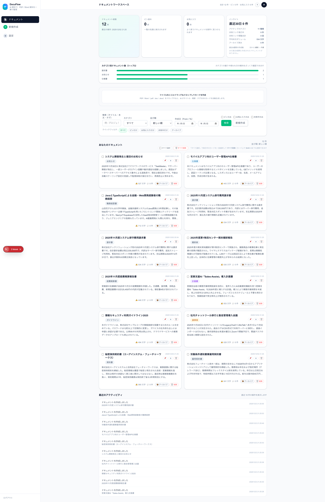
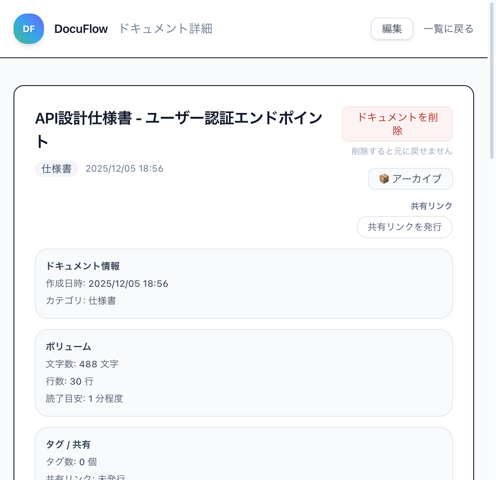
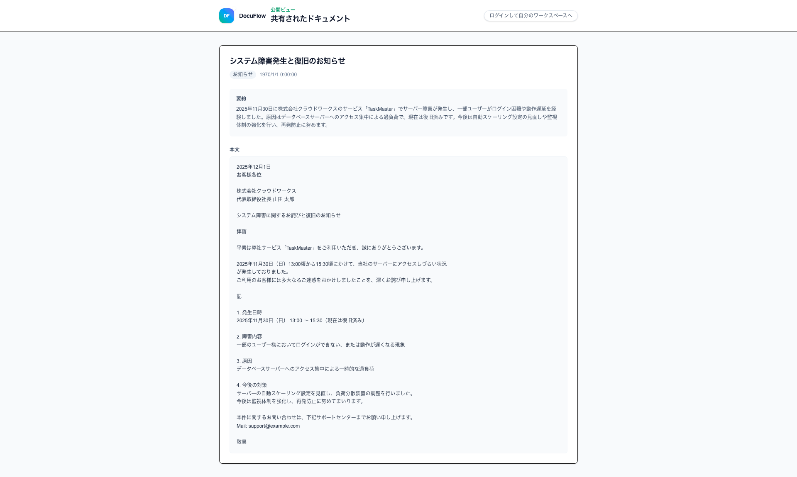

# 📖 概要

> **DocuFlow** は、AI を活用した次世代のドキュメント管理プラットフォームです。

## 🎯 このドキュメントについて

このサイトでは、DocuFlow の技術仕様・設計・運用ガイドなどの開発ドキュメントを公開しています。

## ✨ 主な機能

| 機能 | 説明 |
|:-----|:-----|
| 🤖 **AI 自動要約** | GPT-4.1-mini による高精度な自動要約 |
| 🏷️ **スマートタグ付け** | 文書内容を解析し、最適なタグを自動生成 |
| 🔍 **ベクトル検索** | pgvector + OpenAI Embeddings による意味検索 |
| 📄 **ファイル対応** | PDF・Word ファイルをドラッグ＆ドロップ |
| 🔗 **共有リンク** | ワンクリックで公開リンク発行 |
| 📝 **バージョン履歴** | 編集履歴を自動保存 |

## 🛠️ 技術スタック

- **Frontend**: Next.js 16, React 19, TypeScript, Tailwind CSS
- **Backend**: Supabase (PostgreSQL, Auth, RLS)
- **AI**: OpenAI GPT-4.1-mini, text-embedding-3-small
- **Infrastructure**: Vercel, GitHub Actions
- **Monitoring**: Sentry

## 📸 スクリーンショット

### ダッシュボード

### ドキュメント詳細

### 共有ビュー

## 🔗 クイックリンク

- [🌐 Live Demo](https://docuflow-azure.vercel.app)
- [📂 GitHub Repository](https://github.com/AyumuKobayashiproducts/docuflow)
- [📋 機能仕様書](spec-docuflow.md)
- [🗄️ DB スキーマ](db-schema.md)

## 📝 ドキュメント一覧

| カテゴリ | ドキュメント |
|:---------|:-------------|
| 設計 | [仕様書](spec-docuflow.md) / [DBスキーマ](db-schema.md) / [アーキテクチャ](architecture.md) / [UIフロー](ui-flow.md) |
| 運用 | [監視設計](monitoring.md) / [エラーハンドリング](error-handling.md) / [運用ガイド](operations.md) |
| 管理 | [GitHub Issues](github-issues.md) / [デモデータ](demo-data.md) |

---

  
Made with ❤️ using Next.js, Supabase & OpenAI

